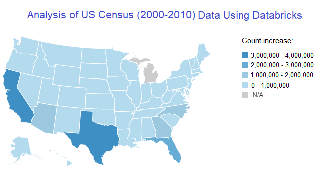

  

      <ul class="nav">
          <li><a href="geneticmaps_fig3.html">prev</a></li>
          <li><a href="tian2016_fig4.html">next</a></li>
      </ul>
  

A databricks project analysing the US Census Data from years 2000 and 2010, identifying trends in population change in regards to state and county migrations, gender, and age brackets. 
[Project Paper: ](https://dagherfadi.github.io/assets/USCensurFinalPaper.pdf)

The graph is of the US map showing the population increase (darker colors indicate higher increase)
